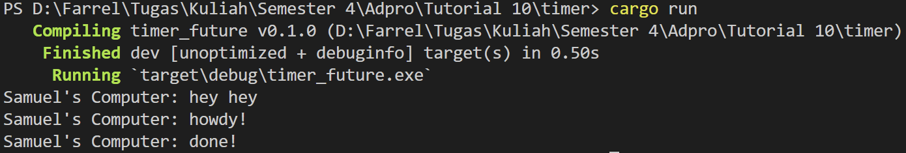
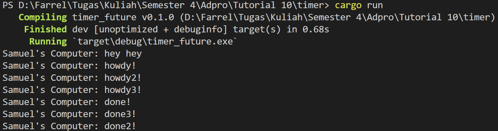
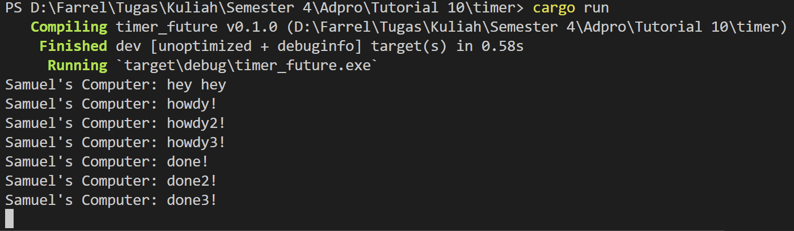

# Modul 9 - High Level Networking
**Samuel Farrel Bagasputra - 2206826614 - Adpro C**
  

## Experiment 1.2: Understanding how it works
What happenned when you run the program ?   

**Explanation** - *Samuel's Computer: hey hey* diprint terlebih dahulu dibandingkan pesan yang lain
 

Hal ini terjadi karena `println!("Samuel's Computer: hey hey")` berada diluar asynchronus task yang akan dieksekusi ketika `executor.run()` dijalankan. Jadi ketika `main` dijalankan, `println!("Samuel's Computer: hey hey")` akan dijalankan terlebih dahulu sebelum task asynchronus dijalankan.  

## Experiment 1.3: Multiple Spawn and removing drop
### Multiple Spawn

**Explanation** - Ketika kita melakukan multiple spawn, maka task akan dijalankan secara asynchronus dan berjalan secara bersamaan. Urutan task yang dijalankan tidak bisa diprediksi, bisa saja task 1 dijalankan terlebih dahulu atau task 2 dijalankan terlebih dahulu. Hal ini terjadi karena task dijalankan secara asynchronus dan tidak ada yang menentukan task mana yang harus dijalankan terlebih dahulu. 

### Removing Drop

**Explanation** - Ketika kita menghapus drop, maka task akan terus berjalan dan program tidak berhenti sampai task selesai dijalankan. Hal ini terjadi karena task tidak dihentikan ketika program selesai dijalankan, task akan terus berjalan sampai task didrop.
